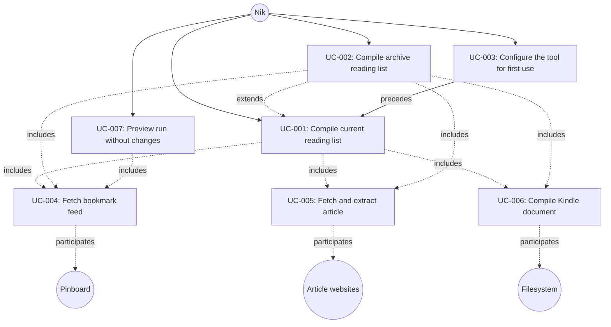

# The Wharfinger Courier -- Use Cases

## Introduction

The Wharfinger Courier is a personal command-line tool that compiles articles bookmarked on Pinboard into a clean, well-formatted Kindle document. These use cases describe the system's behavior from the actor's perspective: how Nik invokes the tool, how it fetches and processes bookmarked articles, and how it produces output ready for offline reading.

The behavioral scope covers the full pipeline from initial configuration through bookmark retrieval, article extraction, and document compilation. It also covers a dry-run preview mode and an archive variant that processes previously-read bookmarks. The system interacts with Pinboard as a read-only feed source, fetches article content from the open web, and uses the local filesystem for caching, state tracking, and output.

## Actor Catalog

| Actor | Type | Description |
|-------|------|-------------|
| Nik | Primary | Sole user; invokes the CLI |
| Pinboard | Supporting | External read-only JSON feed source |
| Article websites | Supporting | External HTTP sources for article content |
| Filesystem | Supporting | Cache, state, log, and output storage |

## Use Case Index

| UC-ID | Title | Actor | Level | Priority |
|-------|-------|-------|-------|----------|
| [UC-001](./UC-001-compile-current-reading-list.md) | Compile current reading list | Nik | User Goal | Must-have |
| [UC-002](./UC-002-compile-archive-reading-list.md) | Compile archive reading list | Nik | User Goal | Should-have |
| [UC-003](./UC-003-configure-the-tool-for-first-use.md) | Configure the tool for first use | Nik | User Goal | Must-have |
| [UC-004](./UC-004-fetch-bookmark-feed.md) | Fetch bookmark feed | System | Subfunction | Must-have |
| [UC-005](./UC-005-fetch-and-extract-article.md) | Fetch and extract article | System | Subfunction | Must-have |
| [UC-006](./UC-006-compile-kindle-document.md) | Compile Kindle document | System | Subfunction | Must-have |
| [UC-007](./UC-007-preview-run-without-changes.md) | Preview run without changes | Nik | User Goal | Should-have |

## Use Case Diagram

### Relationship Summary

- **UC-001** (Compile current reading list) includes UC-004, UC-005, UC-006
- **UC-002** (Compile archive reading list) extends UC-001; includes UC-004, UC-005, UC-006
- **UC-003** (Configure the tool for first use) precedes UC-001
- **UC-007** (Preview run without changes) includes UC-004

## Coverage Notes

- **Nik** is fully covered as the primary actor across all user-goal-level use cases (UC-001, UC-002, UC-003, UC-007).
- **Pinboard** is covered through UC-004 (Fetch bookmark feed), which is included by both main compilation paths and the preview mode.
- **Article websites** are covered through UC-005 (Fetch and extract article), included by both compilation use cases.
- **Filesystem** is covered through UC-006 (Compile Kindle document) for output, and implicitly through caching and state in the compilation flows.

## Guidance

Use cases are technology-agnostic behavioral specifications in Cockburn fully-dressed format. They describe what the system does from the actor's perspective, not how it is implemented. Each use case includes a main success scenario, extensions for alternate and error paths, preconditions, postconditions, and business rules. They serve as the primary input for feature specification and test design.
