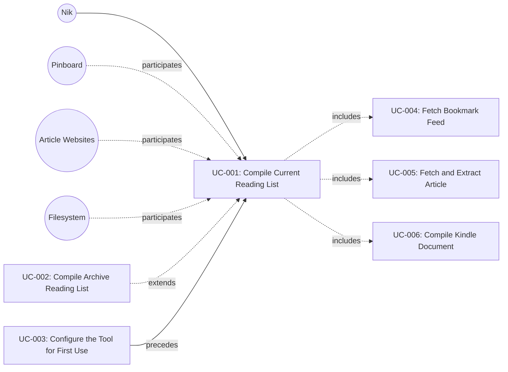

# UC-001: Compile Current Reading List

**Primary Actor:** Nik
**Goal:** Compile unread Pinboard bookmarks into a single Kindle-ready document
**Scope:** The Wharfinger Courier
**Level:** User Goal

## Use Case Diagram

## Preconditions

- The tool has been configured for first use (UC-003 completed): configuration file exists with valid Pinboard feed URL and output directory
- The configured output directory is writable

## Trigger

Nik runs `courier` with no flags (or with no archive/dry-run flags).

## Main Success Scenario

1. Nik invokes `courier`.
2. The system reads status.json from the state directory to determine which articles have already been compiled.
3. The system invokes UC-004 (Fetch Bookmark Feed) to retrieve the current Pinboard `toread` feed.
4. The system identifies uncompiled bookmarks from the feed, up to the configured maximum (default 30), skipping any articles already in COMPILED state.
5. For each uncompiled article, the system invokes UC-005 (Fetch and Extract Article) to obtain and extract the article content.
6. The system invokes UC-006 (Compile Kindle Document) to assemble all extracted articles into a single XHTML document.
7. The system writes the output file (`wharfinger-courier-<YYYY-MM-DD>.xhtml`) to the configured output directory.
8. The system atomically updates status.json with the results of this run (per-article statuses, run timestamps, duration, document metadata).
9. The system appends a summary of major actions to courier.log.
10. The system prints a run summary to stdout: articles fetched, compiled, failed, and the output file path. If any articles are in suspect state, their titles are listed individually in the summary (or a reference to courier.log is printed if the list is long).

## Extensions

**2a. status.json does not exist (first run):**
1. The system treats all feed articles as uncompiled.
2. Rejoin step 3.

**2b. status.json is corrupted or unreadable:**
1. The system reports the error to stdout and logs it.
2. The system prints recovery guidance: Nik may delete or rename the corrupted status.json and re-run, which will cause the tool to treat all articles as new (per extension 2a).
3. Use case ends in failure. No files are written.

**3a. Pinboard feed is unreachable or returns an error:**
1. The system reports the feed error to stdout and logs it.
2. Use case ends in failure. status.json is not updated.

**4a. No uncompiled bookmarks found in the feed:**
1. The system prints a message to stdout indicating there are no new articles to compile.
2. The system logs the outcome.
3. Use case ends with success (no document produced, but this is a valid outcome).

**5a. An individual article fetch fails:**
1. The system increments the article's fetch_attempts counter and sets its status to FETCH_FAILED.
2. The system logs the failure and continues to the next article.
3. Rejoin step 5 (next article).

**5b. An article is already cached or extracted from a previous interrupted run:**
1. The system reuses the cached/extracted content without re-fetching.
2. Rejoin step 5 (continue processing).

**5c. An article has reached 10 failed fetch attempts:**
1. The system sets the article's status to PERMANENTLY_SKIPPED.
2. The system logs the permanent skip and continues to the next article.
3. Rejoin step 5 (next article).

**5d. All articles fail to fetch or extract:**
1. No articles are available for compilation.
2. The system logs the outcome and prints a summary indicating all articles failed.
3. The system updates status.json with the per-article failure statuses.
4. Use case ends with partial success (status updated, no document produced).

**7a. Output directory is not writable:**
1. The system reports the write error to stdout and logs it.
2. Per-article statuses (e.g. EXTRACTED) that were set during this run are persisted in status.json. The next run will re-attempt compilation from the EXTRACTED state without re-fetching those articles.
3. Use case ends in failure. No output document is produced, but status.json reflects the article extraction outcomes.

## Postconditions

**Success guarantee:** A new XHTML document exists in the configured output directory containing all successfully extracted articles. status.json reflects the current state of every article (COMPILED for successes, FETCH_FAILED or PERMANENTLY_SKIPPED for failures). courier.log contains entries for this run.

**Minimal guarantee:** status.json is written atomically reflecting all article outcomes from this run, regardless of whether a document was produced. courier.log entries for any actions already taken are preserved. Any articles cached during this run remain in the cache for future runs.

## Business Rules

- BR-1: The maximum number of articles per run is capped by configuration (default 30).
- BR-2: Articles already in COMPILED state in status.json are skipped.
- BR-3: Articles in CACHED or EXTRACTED state are reused, not re-fetched (enables resume after interruption).
- BR-4: An article is marked PERMANENTLY_SKIPPED after 10 cumulative failed fetch attempts across runs.
- BR-5: status.json is written atomically to prevent corruption from interrupted writes.
- BR-6: If the tool runs twice on the same day, the second run overwrites the output file from the first run. This is intentional: status.json is updated to reflect the current state, and the new document supersedes the previous one. UC-006 follows this same policy.

## Related Use Cases

- **Includes:** UC-004 Fetch Bookmark Feed — retrieves the Pinboard feed to identify articles
- **Includes:** UC-005 Fetch and Extract Article — fetches and extracts each individual article
- **Includes:** UC-006 Compile Kindle Document — assembles extracted articles into the output XHTML
- **Extended by:** UC-002 Compile Archive Reading List — changes article selection to include articles from last N days regardless of compiled status
- **Preceded by:** UC-003 Configure the Tool for First Use — configuration must exist before a compile run

## Metadata

- **Priority:** Must-have
- **Complexity:** L
- **Screen References:** None
