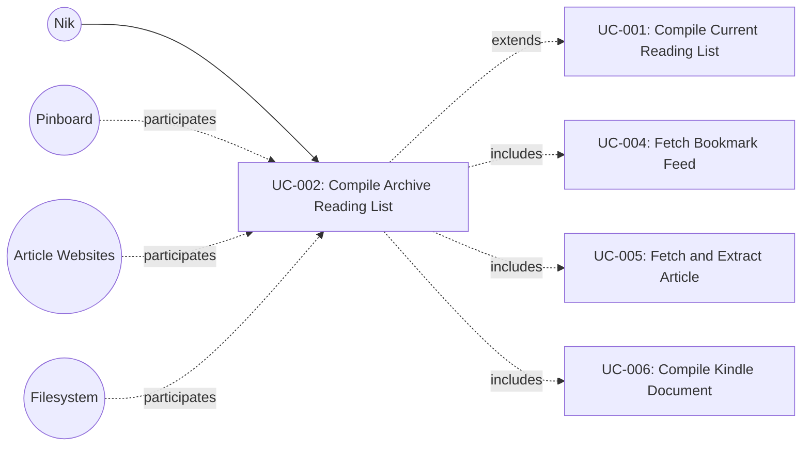

# UC-002: Compile Archive Reading List

**Primary Actor:** Nik
**Goal:** Compile articles bookmarked within the last N days into a single Kindle-ready document, regardless of whether they were previously compiled
**Scope:** The Wharfinger Courier
**Level:** User Goal

## Use Case Diagram

## Preconditions

- The tool has been configured for first use (UC-003 completed): configuration file exists with valid Pinboard feed URL and output directory
- The configured output directory is writable

## Trigger

Nik runs `courier --since N`, where N is a positive integer number of days.

## Main Success Scenario

1. Nik invokes `courier --since N`.
2. The system validates N as a positive integer. (See extension 1a for invalid values.)
3. The system reads status.json from the state directory to load cached article states.
4. The system invokes UC-004 (Fetch Bookmark Feed) to retrieve the current Pinboard `toread` feed.
5. The system selects all articles bookmarked within the last N calendar days, regardless of their compiled status, ordered most-recently-bookmarked first, up to the configured maximum (default 30). If the cap is reached, the system prints a message to stdout stating how many matching articles were excluded.
6. For each selected article, the system invokes UC-005 (Fetch and Extract Article) to obtain and extract the article content, reusing cached content where available (as per UC-001 BR-3).
7. The system invokes UC-006 (Compile Kindle Document) to assemble all extracted articles into a single XHTML document.
8. The system writes the output file (`wharfinger-courier-<YYYY-MM-DD>.xhtml`) to the configured output directory.
9. The system atomically updates status.json with the results of this run (as per UC-001 BR-5).
10. The system appends a summary of major actions to courier.log.
11. The system prints a run summary to stdout: articles fetched, compiled, failed, suspect, and the output file path.

## Extensions

**1a. N is invalid (non-numeric, zero, or negative):**
1. The system prints an error message to stdout indicating that --since requires a positive integer value.
2. Use case ends in failure. No files are read or written.

**3a. status.json does not exist (first run):**
1. The system proceeds with no prior state; all matching articles are treated as new.
2. Rejoin step 4.

**3b. status.json is corrupted or unreadable:**
1. The system reports the error to stdout and logs it.
2. Use case ends in failure. No files are written.

**4a. Pinboard feed is unreachable or returns an error:**
1. The system reports the feed error to stdout and logs it.
2. Use case ends in failure. status.json is not updated.

**5a. No articles fall within the N-day window:**
1. The system prints a message to stdout indicating there are no articles within the requested period.
2. The system logs the outcome.
3. Use case ends with success (no document produced, but this is a valid outcome).

**6a. An individual article fetch fails:**
1. The system increments the article's fetch_attempts counter and sets its status to FETCH_FAILED.
2. The system logs the failure and continues to the next article.
3. Rejoin step 6 (next article).

**6b. An article is already cached from a previous run:**
1. The system reuses the cached content without re-fetching.
2. Rejoin step 6 (continue processing).

**6c. An article has reached 10 failed fetch attempts:**
1. The system sets the article's status to PERMANENTLY_SKIPPED (as per UC-001 BR-4).
2. The system logs the permanent skip and continues to the next article.
3. Rejoin step 6 (next article).

**6d. All articles fail to fetch or extract:**
1. No articles are available for compilation.
2. The system logs the outcome and prints a summary indicating all articles failed.
3. The system updates status.json with the per-article failure statuses.
4. Use case ends with partial success (status updated, no document produced).

**8a. Output directory is not writable:**
1. The system reports the write error to stdout and logs it.
2. Use case ends in failure. status.json is not updated with document metadata.

## Postconditions

**Success guarantee:** A new XHTML document exists in the configured output directory containing all successfully extracted articles from the N-day window (including articles that were previously compiled). status.json reflects the current state of every processed article. courier.log contains entries for this run.

**Minimal guarantee:** status.json is written atomically reflecting all article outcomes from this run, regardless of whether a document was produced (as per UC-001). courier.log entries for any actions already taken are preserved. Any articles cached during this run remain in the cache for future runs.

## Business Rules

- BR-1: The N-day window is calendar-based: articles are selected whose `bookmarked_at` date falls within the last N calendar days from today's date, not a rolling N*24-hour window.
- BR-2: Previously compiled articles are included in the selection (unlike UC-001, which skips them).
- BR-3: Cached article content is reused where available, even for previously compiled articles (as per UC-001 BR-3).
- BR-4: The maximum number of articles per run is capped by configuration (default 30), applied after the date filter. Articles are ordered most-recently-bookmarked first; articles beyond the cap are excluded.
- BR-5: An article is marked PERMANENTLY_SKIPPED after 10 cumulative failed fetch attempts across runs (as per UC-001 BR-4).
- BR-6: status.json is written atomically to prevent corruption from interrupted writes (as per UC-001 BR-5).
- BR-7: Same-day filename collision policy applies: a second run on the same day overwrites the previous output file (as per UC-001 BR-6).
- BR-8: Combining --dry-run with --since N is not supported in v1. There is no preview mode for archive compilation; Nik must run the archive compile to see results.

## Related Use Cases

- **Extends:** UC-001 Compile Current Reading List — changes article selection from "uncompiled only" to "all articles within last N days"
- **Includes:** UC-004 Fetch Bookmark Feed — retrieves the Pinboard feed to identify articles
- **Includes:** UC-005 Fetch and Extract Article — fetches and extracts each individual article
- **Includes:** UC-006 Compile Kindle Document — assembles extracted articles into the output XHTML

## Metadata

- **Priority:** Should-have
- **Complexity:** M
- **Screen References:** None
