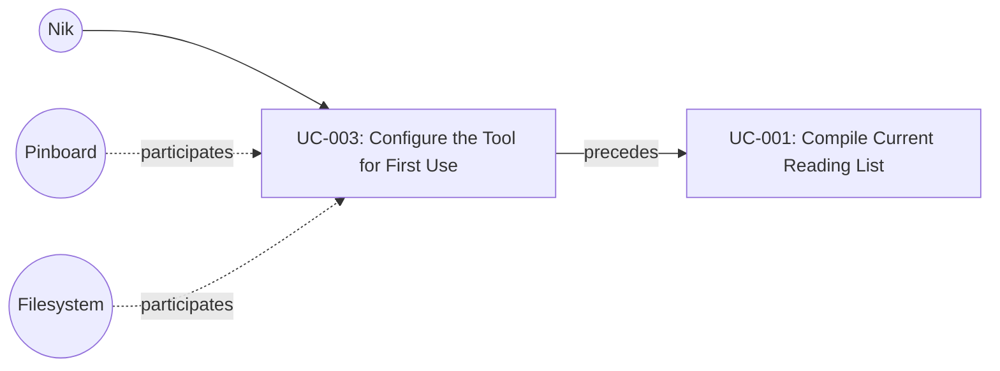

# UC-003: Configure the Tool for First Use

**Primary Actor:** Nik
**Goal:** Establish a valid configuration so the tool can operate on subsequent runs
**Scope:** The Wharfinger Courier
**Level:** User Goal

## Use Case Diagram

## Preconditions

- The tool is installed and available on the command line.
- Nik has a valid Pinboard account with an accessible JSON feed URL.

## Trigger

Nik prepares to use the tool for the first time: creates a configuration file and invokes the tool to validate it. This use case covers initial setup only. On subsequent invocations, the tool validates the configuration silently as a precondition to its main use cases (UC-001, UC-002, UC-007); a missing or invalid configuration on those runs exits with the same errors described in the extensions below.

## Main Success Scenario

1. Nik creates a TOML configuration file from the documentation template, filling in required fields: `pinboard_feed_url`, `cache_dir`, and `output_dir`, and optionally overriding defaults for `max_fetch_attempts` and `max_articles_per_run`.
2. Nik places the configuration file either at `courier.toml` in the project directory or at `~/.config/courier/config.toml`.
3. Nik invokes the tool.
4. The system locates the configuration file (checking the project directory first, then the user config directory).
5. The system validates that all required fields (`pinboard_feed_url`, `cache_dir`, `output_dir`) are present in the configuration file.
6. The system checks that `cache_dir` and `output_dir` exist or can be created, creating them if necessary.
7. The system performs a test HTTP GET request against the `pinboard_feed_url` to verify the feed is reachable. If the request fails, the system prints a warning (not a fatal error) and proceeds; the feed will be validated on the first real run.
8. The system confirms configuration is valid and proceeds with the requested operation.
9. The system logs the successful configuration validation to courier.log.

## Extensions

**4a. No configuration file found in either location:**
1. The system exits with an error message identifying both searched paths and stating that no configuration file was found.
2. Use case ends in failure.

**4b. The configuration file cannot be parsed (syntax error, invalid encoding, malformed TOML):**
1. The system exits with an error message identifying the file path and describing the parse error (including line number if available).
2. Use case ends in failure.

**5a. One or more required fields are missing:**
1. The system exits with an error message identifying each missing field by name.
2. Use case ends in failure.

**6a. A directory path is invalid or cannot be created (e.g., permission denied):**
1. The system exits with an error message identifying which directory (`cache_dir` or `output_dir`) failed and the reason.
2. Use case ends in failure.

**7a. The Pinboard feed URL is unreachable (network error, timeout, HTTP error) during configuration validation:**
1. The system prints a warning to stdout stating the feed URL could not be reached and including the nature of the failure.
2. The system confirms the configuration file is otherwise valid and continues.
3. The feed URL will be validated on the first real run (UC-004 extension 2a / 3a).

## Postconditions

**Success guarantee:** A validated configuration file exists in a known location. The `cache_dir` and `output_dir` directories exist on the filesystem. A validation entry has been written to courier.log.
**Minimal guarantee:** No system state is modified if validation fails. Any directories created during step 6 before a later failure may persist. A transient feed connectivity failure (ext 7a) does not constitute overall validation failure.

## Business Rules

- The configuration file must be in TOML format.
- Required fields are: `pinboard_feed_url`, `cache_dir`, `output_dir`.
- Optional fields and their defaults:
  - `max_fetch_attempts`: 10 — maximum cumulative fetch attempts per article before it is permanently skipped (UC-001 BR-4)
  - `max_articles_per_run`: 30 — maximum number of articles compiled in a single run (UC-001 BR-1)
  - `http_timeout`: 30 (seconds) — per-request timeout for article fetches (UC-005 precondition)
  - `min_word_count`: 100 — minimum word count threshold for primary content extraction before the fallback extractor is attempted (UC-005 precondition)
  - `max_response_size`: 10485760 (10 MB) — maximum HTTP response body size in bytes; responses exceeding this are treated as FETCH_FAILED (UC-005 ext 4c)
- The tool does not create or modify the configuration file itself; Nik provides it manually.
- Project-directory `courier.toml` takes precedence over `~/.config/courier/config.toml` if both exist.
- The tool appends a validation entry to courier.log on successful configuration (step 9). Configuration errors are not logged (the log may not yet exist at that point).

## Related Use Cases

- **Precedes:** UC-001 Compile Current Reading List — valid configuration is required before any reading list compilation.

## Metadata

- **Priority:** Must-have
- **Complexity:** S
- **Screen References:** None
