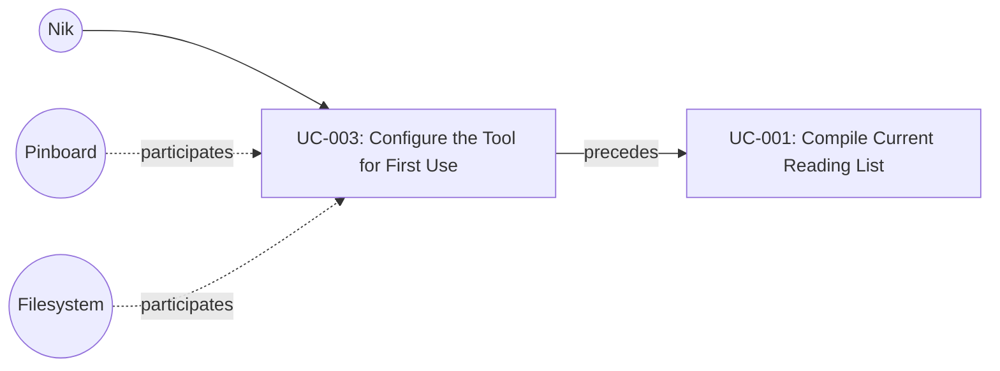

# UC-003: Configure the Tool for First Use

**Primary Actor:** Nik
**Goal:** Establish a valid configuration so the tool can operate on subsequent runs
**Scope:** The Wharfinger Courier
**Level:** User Goal

## Use Case Diagram

## Preconditions

- The tool is installed and available on the command line.
- Nik has a valid Pinboard account with an accessible JSON feed URL.

## Trigger

Nik runs the tool for the first time (or any time no `status.json` exists in the expected location).

## Main Success Scenario

1. Nik creates a TOML configuration file from the documentation template, filling in required fields: `pinboard_feed_url`, `cache_dir`, and `output_dir`, and optionally overriding defaults for `max_fetch_attempts` and `max_articles_per_run`.
2. Nik places the configuration file either at `courier.toml` in the project directory or at `~/.config/courier/config.toml`.
3. Nik invokes the tool.
4. The system locates the configuration file (checking the project directory first, then the user config directory).
5. The system validates that all required fields (`pinboard_feed_url`, `cache_dir`, `output_dir`) are present in the configuration file.
6. The system checks that `cache_dir` and `output_dir` exist or can be created, creating them if necessary.
7. The system performs a test HTTP GET request against the `pinboard_feed_url` to verify the feed is reachable.
8. The system confirms configuration is valid and proceeds with the requested operation.

## Extensions

**4a. No configuration file found in either location:**
1. The system exits with an error message identifying both searched paths and stating that no configuration file was found.
2. Use case ends in failure.

**5a. One or more required fields are missing:**
1. The system exits with an error message identifying each missing field by name.
2. Use case ends in failure.

**6a. A directory path is invalid or cannot be created (e.g., permission denied):**
1. The system exits with an error message identifying which directory (`cache_dir` or `output_dir`) failed and the reason.
2. Use case ends in failure.

**7a. The Pinboard feed URL is unreachable (network error, timeout, HTTP error):**
1. The system exits with an error message stating the feed URL could not be reached and including the nature of the failure.
2. Use case ends in failure.

## Postconditions

**Success guarantee:** A validated configuration file exists in a known location. The `cache_dir` and `output_dir` directories exist on the filesystem. The Pinboard feed URL has been confirmed reachable at least once.
**Minimal guarantee:** No system state is modified if validation fails. Any directories created during step 6 before a later failure may persist.

## Business Rules

- The configuration file must be in TOML format.
- Required fields are: `pinboard_feed_url`, `cache_dir`, `output_dir`.
- `max_fetch_attempts` defaults to 10 if not specified.
- `max_articles_per_run` defaults to 30 if not specified.
- The tool does not create or modify the configuration file itself; Nik provides it manually.
- Project-directory `courier.toml` takes precedence over `~/.config/courier/config.toml` if both exist.

## Related Use Cases

- **Precedes:** UC-001 Compile Current Reading List — valid configuration is required before any reading list compilation.

## Metadata

- **Priority:** Must-have
- **Complexity:** S
- **Screen References:** None
