# UC-004: Fetch Bookmark Feed

**Primary Actor:** System
**Goal:** Retrieve the bookmark feed and identify new and existing bookmarks
**Scope:** The Wharfinger Courier
**Level:** Subfunction

## Use Case Diagram

```mermaid
graph LR
    System((System)) --> UC004[UC-004: Fetch Bookmark Feed]
    Pinboard((Pinboard)) -.participates.-> UC004
    Filesystem((Filesystem)) -.participates.-> UC004
    UC001[UC-001: Compile Current Reading List] -.includes.-> UC004
    UC002[UC-002: Compile Archive Reading List] -.includes.-> UC004
    UC007[UC-007: Preview Run Without Changes] -.includes.-> UC004
    click UC001 "./UC-001-compile-current-reading-list.md" "Open use case"
    click UC002 "./UC-002-compile-archive-reading-list.md" "Open use case"
    click UC007 "./UC-007-preview-run-without-changes.md" "Open use case"
```

## Preconditions

- A validated configuration file exists with a valid `pinboard_feed_url`.
- Network access to the Pinboard service is available.

## Trigger

An orchestrating use case (UC-001, UC-002, or UC-007) invokes the feed fetch step.

## Main Success Scenario

1. The system reads the `pinboard_feed_url` from the configuration.
2. The system sends an HTTP GET request to the feed URL.
3. Pinboard responds with an HTTP 200 and a JSON array of bookmark objects (each containing `href`, `description`, `time`, and `toread` fields).
4. The system parses the JSON response into a list of bookmark records.
5. The system returns the parsed bookmark list to the orchestrating use case. All filtering, partitioning, and status cross-referencing is the orchestrator's responsibility.

## Extensions

**2a. Network error or connection timeout:**
1. The system reports a fatal error identifying the nature of the network failure.
2. The current run is aborted.
3. Use case ends in failure.

**3a. Pinboard responds with an HTTP 4xx or 5xx status:**
1. The system reports a fatal error including the HTTP status code.
2. The current run is aborted.
3. Use case ends in failure.

**4a. The response body is not valid JSON or not a JSON array:**
1. The system reports a fatal error indicating the feed response could not be parsed.
2. The current run is aborted.
3. Use case ends in failure.

## Postconditions

**Success guarantee:** The orchestrating use case receives the full parsed bookmark list from the feed. No state files are modified by this use case.
**Minimal guarantee:** No state files are modified regardless of outcome. If the fetch fails, the orchestrating use case receives a fatal error indication.

## Business Rules

- Exactly one HTTP GET request is made per invocation; the system does not retry within this use case.
- Any feed-level failure (network, HTTP error, malformed JSON) is fatal to the current run because no subsequent steps can proceed without bookmark data.
- UC-004 does not read or write `status.json`. All cross-referencing of feed bookmarks against known article state (e.g. identifying uncompiled or date-windowed articles) is performed by the orchestrating use case after receiving the feed list.

## Related Use Cases

- **Included by:** UC-001 Compile Current Reading List — provides the bookmark data for a current reading list run.
- **Included by:** UC-002 Compile Archive Reading List — provides the bookmark data for an archive reading list run.
- **Included by:** UC-007 Preview Run Without Changes — provides the bookmark data for a dry-run preview.

## Metadata

- **Priority:** Must-have
- **Complexity:** S
- **Screen References:** None
