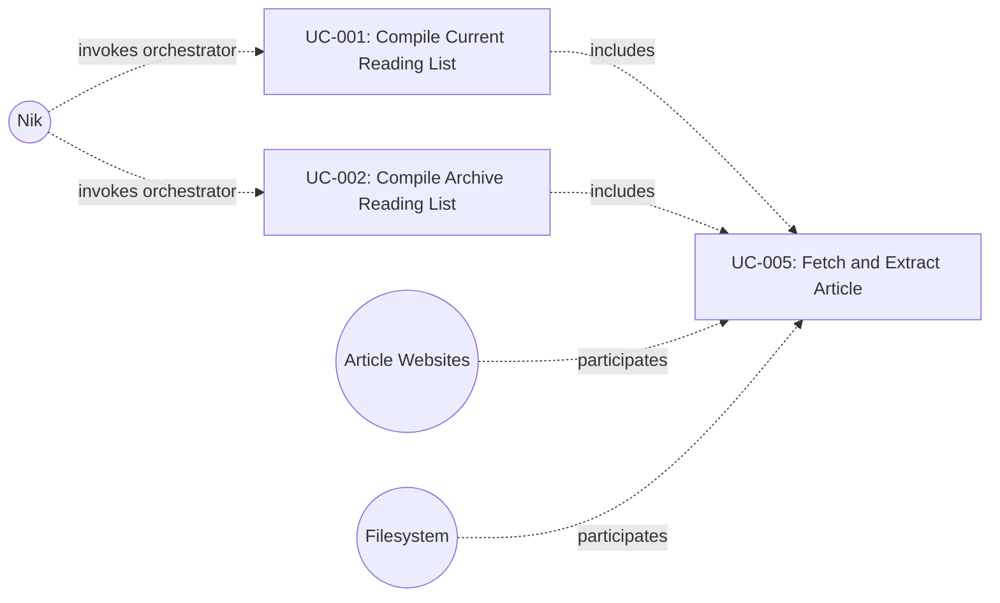

# UC-005: Fetch and Extract Article

**Primary Actor:** System (invoked by orchestrator on behalf of Nik)
**Goal:** Retrieve a single article's web content and extract its readable body text
**Scope:** The Wharfinger Courier
**Level:** Subfunction

## Use Case Diagram

## Preconditions

- The orchestrator has a valid article URL and its corresponding URL hash (SHA-256, hex-encoded)
- The cache directory exists and is writable
- HTTP timeout and minimum word-count threshold are configured

## Trigger

The orchestrator passes an uncompiled article URL to the extraction pipeline.

## Main Success Scenario

1. The system computes the cache path from the URL hash.
2. The system checks the cache for `cache/<url-hash>/extracted.html`.
3. The cached extracted file does not exist; the system checks for `cache/<url-hash>/raw.html`.
4. The cached raw file does not exist; the system sends an HTTP GET request to the article URL using the configured timeout.
5. The article website returns the HTML response.
6. The system writes the response body to `cache/<url-hash>/raw.html`.
7. The system runs the primary content extractor against the raw HTML, producing a title and body.
8. The extracted body meets or exceeds the configured minimum word-count threshold.
9. The system sanitises the extracted HTML to valid XHTML.
10. The system writes the result to `cache/<url-hash>/extracted.html`.
11. The system records the article status as EXTRACTED, along with word count, HTTP status code, and content type.
12. The system returns extraction results to the orchestrator.

## Extensions

**2a. Cached extracted file already exists:**
1. The system records the article status as EXTRACTED (from cache).
2. The system returns the cached extraction results to the orchestrator. Use case ends.

**3a. Cached raw file exists but extracted file does not:**
1. The system skips the HTTP fetch and proceeds to step 7 using the cached raw HTML.

**4a. HTTP request fails (network error, timeout, non-success status):**
1. The system records the article status as FETCH_FAILED, along with any available HTTP status code.
2. The system returns the failure to the orchestrator. Use case ends. The orchestrator continues with the next article.

**8a. Extracted body falls below the minimum word-count threshold:**
1. The system marks the article as suspect.
2. The system runs the fallback content extractor against the raw HTML.
3. The fallback extractor produces sufficient content: the system continues from step 9 with the fallback output.

**8a.2a. Fallback extractor also returns insufficient content:**
1. The system records the article status as EXTRACTION_FAILED, along with word count.
2. The system returns the failure to the orchestrator. Use case ends. The orchestrator continues with the next article.

## Postconditions

**Success guarantee:** `cache/<url-hash>/extracted.html` contains valid XHTML of the article body. The article's status is EXTRACTED with word count, HTTP status code, content type, and suspect flag recorded.

**Minimal guarantee:** Any partial data written to the cache remains on disk. The article's status reflects the outcome (EXTRACTED, FETCH_FAILED, or EXTRACTION_FAILED). The overall run is not aborted regardless of this article's outcome.

## Business Rules

- The URL hash is the SHA-256 of the article URL, hex-encoded.
- Cache hits at any level (raw or extracted) skip the corresponding earlier steps; the system never re-fetches or re-extracts content that is already cached.
- Extraction failures are isolated per article and do not abort the run.
- The suspect flag is set whenever the primary extractor's output falls below the minimum word-count threshold, even if the fallback extractor succeeds.

## Related Use Cases

- **Included by:** UC-001 Compile Current Reading List — invoked once per uncompiled article
- **Included by:** UC-002 Compile Archive Reading List — invoked once per uncompiled article

## Metadata

- **Priority:** Must-have
- **Complexity:** M
- **Screen References:** None
