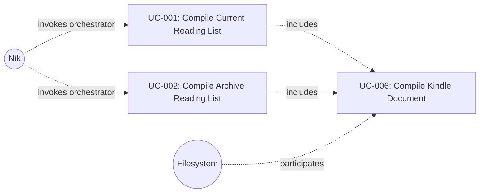

# UC-006: Compile Kindle Document

**Primary Actor:** System (invoked by orchestrator on behalf of Nik)
**Goal:** Assemble all successfully extracted articles into a single Kindle-compatible XHTML document
**Scope:** The Wharfinger Courier
**Level:** Subfunction

## Use Case Diagram

## Preconditions

- All articles in the current run have been processed through UC-005 (each has a terminal status of EXTRACTED, FETCH_FAILED, or EXTRACTION_FAILED)
- The configured output directory exists and is writable
- The XHTML document template is available

## Trigger

The orchestrator signals that all per-article processing is complete and invokes document compilation.

## Main Success Scenario

1. The system collects all articles with status EXTRACTED that have not yet been compiled.
2. At least one extracted article is available.
3. The system renders the XHTML document template with: XML declaration, DOCTYPE, Kindle-compatible head metadata, a table of contents listing all article titles as internal links, and each article's title heading and body in sequence.
4. The system generates the output filename as `wharfinger-courier-<YYYY-MM-DD>.xhtml` using today's date.
5. The system writes the compiled document to the configured output directory.
6. The system updates each included article's status to COMPILED and sets its compiled-in field to the output filename.
7. The system returns document metadata to the orchestrator: filename, article count, and output path.

## Extensions

**1a. Run is in archive mode:**
1. The system also includes articles with status COMPILED that fall within the archive date range.
2. The system continues from step 2 with the combined set.

**2a. Zero articles are available (all failed or none match):**
1. The system does not write a document.
2. The system returns a summary to the orchestrator noting zero compiled articles. Use case ends.

## Postconditions

**Success guarantee:** A valid XHTML file named `wharfinger-courier-<YYYY-MM-DD>.xhtml` exists in the output directory containing a table of contents and the body of every included article. Each included article's status is COMPILED with its compiled-in field set to the output filename.

**Minimal guarantee:** No previously compiled documents or article statuses are altered. If compilation fails partway through, no partial output file is left in the output directory.

## Business Rules

- Exactly one document is produced per run, regardless of article count.
- The output filename always uses today's date in `YYYY-MM-DD` format.
- The compiled document must be valid XHTML with Kindle-compatible metadata.
- Articles appear in the document in the same order they were collected from the feed.
- The zero-articles case is not treated as an error; the run completes normally with a summary.

## Related Use Cases

- **Included by:** UC-001 Compile Current Reading List — invoked once per run after all articles are processed
- **Included by:** UC-002 Compile Archive Reading List — invoked once per run after all articles are processed

## Metadata

- **Priority:** Must-have
- **Complexity:** M
- **Screen References:** None
