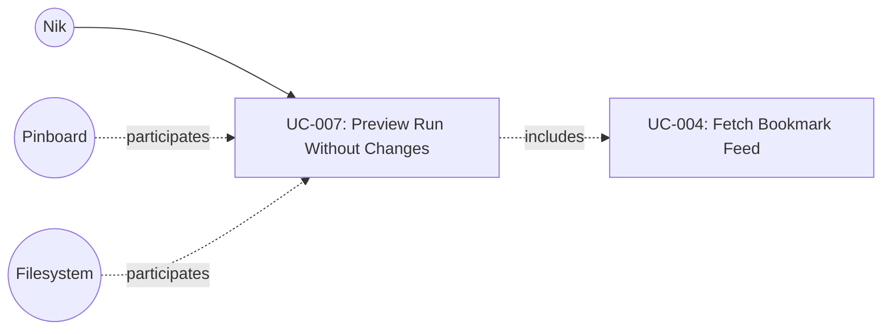

# UC-007: Preview Run Without Changes

**Primary Actor:** Nik
**Goal:** See which articles would be fetched and compiled without making any changes to disk
**Scope:** The Wharfinger Courier
**Level:** User Goal

## Use Case Diagram

## Preconditions

- The tool has been configured for first use (UC-003 completed): configuration file exists with valid Pinboard feed URL

## Trigger

Nik runs `courier --dry-run`.

## Main Success Scenario

1. Nik invokes `courier --dry-run`.
2. The system reads status.json from the state directory to determine which articles are already cached, extracted, or compiled.
3. The system invokes UC-004 (Fetch Bookmark Feed) to retrieve the current Pinboard `toread` feed.
4. The system identifies uncompiled bookmarks from the feed, up to the configured maximum (default 30), applying the same selection logic as UC-001.
5. The system classifies each identified article: those already cached (no fetch needed) versus those requiring a fresh fetch.
6. The system prints a preview to stdout listing each article that would be included (title and URL), the count of cached articles, and the count of articles requiring a fresh fetch. For articles with prior fetch failures, the preview includes a status hint next to the title (e.g. "(failed 3 times, 7 attempts remaining)").

## Extensions

**2a. status.json does not exist (first run):**
1. The system treats all feed articles as new (none cached).
2. Rejoin step 3.

**2b. status.json is corrupted or unreadable:**
1. The system reports the error to stdout.
2. Use case ends in failure.

**3a. Pinboard feed is unreachable or returns an error:**
1. The system reports the feed error to stdout.
2. Use case ends in failure.

**4a. No uncompiled bookmarks found in the feed:**
1. The system prints a message to stdout indicating there are no new articles to compile.
2. Use case ends with success (empty preview is a valid outcome).

## Postconditions

**Success guarantee:** A preview of the prospective run has been printed to stdout. No files have been written, modified, or created. status.json is unchanged. courier.log is unchanged. No article content has been fetched.

**Minimal guarantee:** No files have been written, modified, or created. status.json is unchanged. courier.log is unchanged.

## Business Rules

- BR-1: The dry-run must not write to status.json under any circumstances.
- BR-2: The dry-run must not write to courier.log under any circumstances.
- BR-3: The dry-run must not fetch any article URLs; only the Pinboard feed is fetched. Dry-run is not an offline mode -- it requires network access to retrieve the Pinboard feed.
- BR-4: The dry-run must not produce any output document.
- BR-5: Article selection logic matches UC-001 (uncompiled articles, up to the configured cap).
- BR-6: Combining --dry-run with --since N is not supported in v1. This is an intentional scope decision; dry-run previews only the default (current reading list) selection.

## Related Use Cases

- **Includes:** UC-004 Fetch Bookmark Feed — retrieves the Pinboard feed to identify which articles would be processed

## Metadata

- **Priority:** Should-have
- **Complexity:** S
- **Screen References:** None
