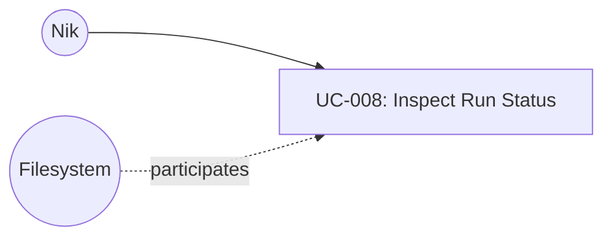

# UC-008: Inspect Run Status

**Primary Actor:** Nik
**Goal:** Review the current state of article processing: counts by status, permanently skipped articles, and recent run history
**Scope:** The Wharfinger Courier
**Level:** User Goal

## Use Case Diagram

## Preconditions

- The tool has been configured for first use (UC-003 completed).
- `status.json` exists in the state directory (at least one run has been completed, or status.json has been initialised).

## Trigger

Nik runs `courier status`.

## Main Success Scenario

1. Nik invokes `courier status`.
2. The system reads `status.json` from the state directory.
3. The system counts articles by status: COMPILED, EXTRACTED, CACHED, FETCH_FAILED, EXTRACTION_FAILED, UNSUPPORTED_CONTENT_TYPE, PERMANENTLY_SKIPPED.
4. The system prints a status summary to stdout:
   - Total articles tracked
   - Count per status
   - Timestamp of the most recent run
   - Output file path from the most recent run (if any)
5. If any articles are in PERMANENTLY_SKIPPED status, the system lists each one with its URL and title (if available).
6. Use case ends.

## Extensions

**2a. `status.json` does not exist:**
1. The system prints a message indicating no runs have been recorded yet.
2. Use case ends with success (empty state is a valid outcome).

**2b. `status.json` is corrupted or unreadable:**
1. The system prints an error identifying the file and the nature of the failure.
2. The system suggests Nik delete or rename the corrupted file.
3. Use case ends in failure.

## Postconditions

**Success guarantee:** A status summary has been printed to stdout. No files have been written, modified, or created.
**Minimal guarantee:** No files have been written, modified, or created regardless of outcome.

## Business Rules

- BR-1: `courier status` is a read-only operation. It never writes to status.json, courier.log, or any other file.
- BR-2: PERMANENTLY_SKIPPED articles are listed individually because they represent articles that will never be retried without manual intervention. All other statuses are shown as counts only.
- BR-3: The status command does not fetch from Pinboard or the web; it reflects only the current on-disk state.

## Related Use Cases

- **Reads state written by:** UC-001 Compile Current Reading List — the primary source of status.json entries
- **Reads state written by:** UC-002 Compile Archive Reading List — also updates status.json

## Metadata

- **Priority:** Could-have
- **Complexity:** S
- **Screen References:** None
